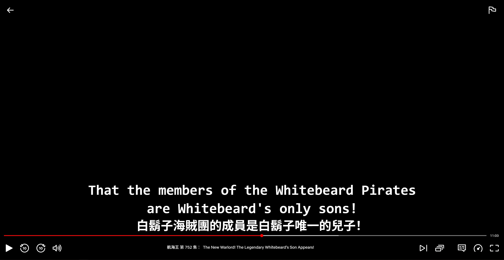
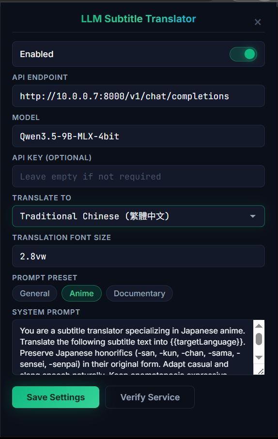

# Local LLM Subtitle Translator

A Chrome extension that translates Netflix subtitles in real-time using a local LLM via any
OpenAI-compatible API endpoint. Bilingual subtitles are rendered in an overlay styled to match
Netflix's native subtitle UI — seamless enough that it looks built-in. Powered by your own
hardware — no cloud, no subscription, no data leaves your network.

---

## Demo

### Bilingual Subtitles



### Settings Panel



---

## Features

- **Real-time translation** — subtitles translated and displayed as they appear
- **Prefetch pipeline** — intercepts subtitle files at download time, batch-translates before playback
- **Two-tier cache** — L1 in-memory (instant) + L2 IndexedDB (persists across sessions, 30-day TTL)
- **Adaptive throughput** — auto-tunes batch size and worker count based on LLM response latency
- **Circuit breaker** — detects server failures, pauses requests for 30s, auto-recovers on probe
- **Seek-aware** — aborts in-flight requests on seek and re-prioritizes prefetch near current position
- **Model-aware caching** — cached translations are keyed on language + model, so switching models or languages never serves stale results
- **Smooth transitions** — 150ms opacity fade-in/out, no subtitle flicker
- **Genre prompt presets** — one-click prompts for General, Anime, and Documentary
- **8 languages built-in** — dropdown with top languages + custom option
- **Any OpenAI-compatible API** — works with MLX, vLLM, Ollama, llama.cpp, LM Studio, Groq, OpenAI
- **Fully local** — all translation stays on your LAN (or use a remote API if preferred)

---

## Architecture

```
Netflix Page (DOM)
      │
      ├── [prefetch.js]     ← MAIN world: intercepts XHR/Fetch, parses TTML & WebVTT
      │         │
      │    window.postMessage (origin-validated)
      │         │
      │         ▼
      │   [content.js]      ← orchestrator: queue → dedup → batch → cache
      │         │
      │         ├── [adaptive.js]    ← throughput controller + circuit breaker
      │         ├── [cache.js]       ← L1 Map (500 LRU) + L2 IndexedDB (30-day TTL)
      │         ├── [translator.js]  ← dedup, timeout, AbortController, batch support
      │         └── [netflix.js]     ← SubtitleProvider: MutationObserver + overlay
      │
      ▼
[service-worker.js]         ← routes API calls (avoids CORS), batch retry
      │
      ▼
LLM Server                  ← OpenAI-compatible /v1/chat/completions
(MLX / vLLM / Ollama / Groq / OpenAI)
```

### Key Design Decisions

**Prefetch at intercept** — `prefetch.js` runs in the `MAIN` world at `document_start`, monkey-patching
`XMLHttpRequest` and `fetch` to capture subtitle payloads before Netflix even renders them. This gives
the extension a head start of several seconds to batch-translate upcoming cues.

**Two-tier cache** — The L1 memory cache provides synchronous, zero-cost lookups on the hot path.
L2 IndexedDB persists translations across page reloads and browser restarts, so re-watching an episode
hits cache for every line. Cache keys include language and model name to prevent stale results when
switching configurations. L2 entries expire after 30 days.

**Adaptive throughput** — The extension starts conservatively (batch=5, workers=2) and measures response
latency. When the LLM responds fast (<2s), it scales up batch size and worker count. When slow (>6s)
or errors occur, it scales down. A cooldown period prevents oscillation. This automatically optimizes
for any hardware — from a laptop GPU to a beefy multi-GPU server.

**Circuit breaker** — After 5 consecutive failures, the extension stops hammering the server and enters
a 30-second degraded mode (showing Netflix originals). It periodically probes with a single request
and auto-recovers when the server is back.

**Seek cancellation** — When the user seeks, all in-flight translation requests are aborted via
`AbortController`, and the prefetch queue is re-sorted by proximity to the new playback position.
This frees LLM capacity for the subtitles the user will actually see.

**SubtitleProvider abstraction** — `netflix.js` implements a provider interface (`start`, `stop`,
`onSeek`, `displayTranslation`, `getCurrentText`), making the core pipeline platform-agnostic and
ready for future multi-platform support.

**Batch + parallel workers** — Subtitles are grouped into adaptive-sized batches and processed by
concurrent workers. A single batch request is far cheaper than N individual requests because it
amortizes the network RTT and LLM prefill cost across all lines. Truncation detection discards
incomplete translations and retries them individually.

**Service worker for CORS** — Content scripts cannot call a local LLM server directly due to browser
CORS restrictions. The background service worker acts as a proxy, making the `fetch()` call from the
extension context where CORS does not apply.

---

## Project Structure

```
local-llm-translator/
├── manifest.json                # Manifest V3 config
├── background/
│   └── service-worker.js        # Translation API proxy (single + batch + retry)
├── content/
│   ├── prefetch.js              # XHR/Fetch intercept, TTML & WebVTT parsing
│   ├── content.js               # Orchestrator: settings, prefetch, lookahead
│   ├── adaptive.js              # Adaptive throughput controller + circuit breaker
│   ├── netflix.js               # SubtitleProvider: MutationObserver + overlay
│   ├── translator.js            # Dedup, timeout, AbortController, batch support
│   └── cache.js                 # L1 Map (LRU) + L2 IndexedDB (TTL, model-aware)
├── popup/
│   ├── popup.html               # Settings UI
│   ├── popup.js                 # Save/load settings, verify service, clear cache
│   └── popup.css                # Dark theme (emerald green / deep navy)
├── styles/
│   └── subtitle.css             # Translation overlay styling + transitions
└── icons/
    ├── icon16.png
    ├── icon48.png
    └── icon128.png
```

---

## Installation

1. Clone or download this repository
2. Open `chrome://extensions` in Chrome
3. Enable **Developer mode** (top right)
4. Click **Load unpacked** and select the `local-llm-translator/` folder
5. Pin the extension to the toolbar

---

## Configuration

Click the extension icon to open the settings popup.

| Setting          | Default                                     | Description                                      |
| ---------------- | ------------------------------------------- | ------------------------------------------------ |
| Enabled          | `true`                                      | Toggle translation on/off                        |
| API Endpoint     | `http://10.0.0.7:8000/v1/chat/completions`  | OpenAI-compatible completions URL                |
| Model            | `Qwen3.5-9B-MLX-4bit`                       | Model name sent in API request                   |
| API Key          | _(empty)_                                   | Optional Bearer token                            |
| Translate To     | `Traditional Chinese`                       | Dropdown with 8 languages + custom option        |
| Font Size        | `2.8vw`                                     | CSS font size for translated subtitles           |
| Prompt Preset    | `General`                                   | One-click genre prompts: General, Anime, Documentary |
| System Prompt    | _(auto-filled by preset)_                   | Editable, supports `{{targetLanguage}}` variable |

Use **Verify Service** to test connectivity — it shows the model name, a sample translation,
response latency, and token throughput (tok/s).

Use **Clear Cache** to purge all stored translations (e.g., after switching models or prompts).

---

## Supported LLM Servers

Any server exposing an OpenAI-compatible `/v1/chat/completions` endpoint:

| Server                                                            | Example Endpoint                          |
| ----------------------------------------------------------------- | ----------------------------------------- |
| [MLX LM Server](https://github.com/ml-explore/mlx-lm)            | `http://localhost:8000/v1/chat/completions`|
| [vLLM](https://github.com/vllm-project/vllm)                     | `http://localhost:8000/v1/chat/completions`|
| [Ollama](https://ollama.com)                                      | `http://localhost:11434/v1/chat/completions`|
| [llama.cpp server](https://github.com/ggml-org/llama.cpp)         | `http://localhost:8080/v1/chat/completions`|
| [LM Studio](https://lmstudio.ai)                                  | `http://localhost:1234/v1/chat/completions`|
| [Groq](https://groq.com)                                          | `https://api.groq.com/openai/v1/chat/completions`|
| [OpenAI](https://openai.com)                                      | `https://api.openai.com/v1/chat/completions`|

---

## How It Works

1. **Intercept** — `prefetch.js` captures Netflix subtitle file downloads (TTML/WebVTT) via
   XHR/Fetch monkey-patching and extracts all cue text
2. **Queue** — `content.js` deduplicates cues against both cache tiers and enqueues uncached ones
3. **Adaptive batch translate** — workers send adaptive-sized batches through `translator.js` to
   the service worker, which calls the LLM with a numbered format for efficient single-request translation
4. **Cache** — Translations are stored in L1 (memory, keyed on text+lang+model) and L2 (IndexedDB, 30-day TTL)
5. **Display** — When Netflix renders a subtitle, `netflix.js` detects it via MutationObserver,
   `content.js` checks cache (instant hit), and the bilingual overlay fades in within 150ms
6. **Lookahead** — Each displayed subtitle triggers background translation of the next 5 uncached cues
7. **Resilience** — Failed translations retry once with backoff, circuit breaker trips after 5
   failures, seek aborts stale requests and re-prioritizes the prefetch queue

---

## Changelog

### v1.4.0
- **Stability fix** — removed aggressive seek-abort that was killing in-flight prefetch on every subtitle gap
- **Increased timeout** — translation request timeout raised from 10s to 60s for slower network/server setups
- **Conservative defaults** — fixed batch=2, workers=1 (no dynamic scaling) for reliable operation
- **Subtitle backdrop** — semi-transparent dark background behind each subtitle line for better readability
- **Seek debounce** — subtitle gaps no longer falsely trigger seek detection; only real seeks (2s+ gap) are detected

### v1.2.0
- **Adaptive throughput controller** — auto-tunes batch size (2–15) and worker count (1–5) based on LLM latency
- **Circuit breaker** — stops requests after 5 consecutive failures, 30s cooldown with auto-recovery probe
- **Seek cancellation** — AbortController cancels in-flight requests on seek, reprioritizes prefetch queue
- **Model-aware cache** — L1 and L2 cache keys include language + model name, prevents stale translations
- **L2 cache TTL** — IndexedDB entries expire after 30 days
- **Clear Cache button** — purge all cached translations from the popup
- **SubtitleProvider abstraction** — netflix.js implements a clean provider interface for future multi-platform support
- **Extracted modules** — adaptive controller and batch translation routing moved to dedicated files
- **Origin validation** — postMessage handler validates event.origin
- **Conditional MLX fields** — `chat_template_kwargs` only sent for MLX-named models

### v1.1.0
- Fix request flood caused by MutationObserver re-triggering during pending translations
- Fix backward seek subtitle loss
- Fix hide timeout race condition
- Fix MutationObserver leak on container change
- Add translation retry with backoff and fallback to Netflix originals
- Cap cue queue at 1000 entries
- Add 10s timeout on service worker messages
- Use collision-safe JSON cache keys
- Add batch missing translation retry in service worker
- Global dedup in prefetch to prevent duplicate cue processing

### v1.0.0
- Initial release

---

## Future Improvements

- **Multi-platform support** — Extend subtitle detection to YouTube, Disney+, and Prime Video
- **Real-time audio translation** — Web Speech API for ASR + LLM translation for non-subtitled content
- **Streaming translation** — Use SSE/streaming API responses to display partial translations as they generate
- **Translation memory** — Export/import cached translations for sharing across devices
- **Model auto-detection** — Query `/v1/models` endpoint to auto-populate the model selector

---

## Tools Used

- [Claude Code](https://claude.ai/code) — AI coding assistant used throughout development
